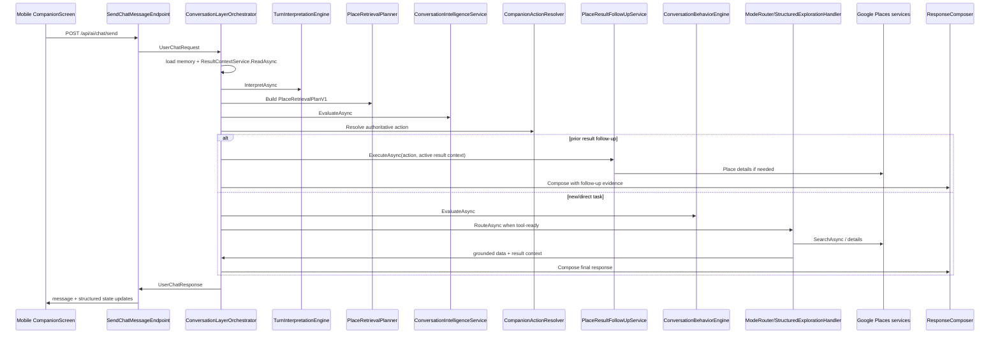

# Repo Architecture and Legacy Audit

Date: 2026-04-29

## 1. Executive Summary

NSFinance is a mobile-first personal finance and banking companion. The repo contains an ASP.NET Core API, an Expo React Native mobile app, a placeholder worker app, shared .NET libraries, deployment scripts, Docker local infrastructure, and documentation.

The current architecture is a modular monolith on the backend: `Program.cs` maps feature modules under `apps/api/src/NSFinance.Api/Modules`, each module exposes minimal API endpoints and services, and EF Core persistence is centralized in `Persistence/AppDbContext.cs`. The mobile app is an Expo Router application with feature folders under `apps/mobile/src/features` and route screens under `apps/mobile/app`.

Highest-risk complexity areas:

- Banking sync is large and stateful. Evidence: `Modules/Banking/Services/BankSyncService.cs` has a very broad call surface and TrueLayer transaction-window logic; workers are registered in `Infrastructure/DependencyInjection/ServiceCollectionExtensions.cs`.
- Companion AI has multiple overlapping layers: interpretation, retrieval planning, conversation intelligence, behavior engine, mode handlers, deterministic decision builder, response composer, result context, and Places retrieval. Evidence: registrations in `Modules/AI/Services/AIServiceCollectionExtensions.cs` and orchestration in `ConversationLayerOrchestrator.cs`.
- Mobile Companion still contains client-side location intent helpers. Evidence: `apps/mobile/src/features/ai/location/chatLocationGrounding.ts` exposes `isNearbyLocationDependentPrompt` and tests lock phrase behavior. This is useful for permission UX but should not become backend routing authority.
- Persistence is active and migration-heavy. Evidence: migrations live under `apps/api/src/NSFinance.Api/Persistence/Migrations`, while `AppDbContext.cs` maps auth, banking, merchant intelligence, conversation memory, result context, and expense-plan entities.

Most likely legacy buildup areas:

- Deterministic Companion routing and fallback services, still registered for guardrails: `DeterministicConversationDecisionBuilder`, `ConversationPolicies`, `ConversationModeHandlers`, `MockAIProviderTransport`.
- Placeholder libraries and worker: `libs/domain/src/NSFinance.Domain/Class1.cs`, `libs/infrastructure/src/NSFinance.Infrastructure/Class1.cs`, `libs/connectors/src/NSFinance.Connectors/Class1.cs`, and `apps/worker/src/NSFinance.Worker`.
- Generated/exported mobile artifacts: `apps/mobile/dist`, `apps/mobile/dist-test`, and checked-in `node_modules`.

## 2. Top-Level Repo Map

| Path | Purpose | Status | Evidence / Notes |
|---|---|---|---|
| `apps/api` | ASP.NET Core API and API test project | Active | `apps/api/NSFinance.Api.slnx`, `src/NSFinance.Api/Program.cs`, `src/NSFinance.Api.Tests` |
| `apps/mobile` | Expo React Native mobile client | Active | `apps/mobile/package.json`, `app/_layout.tsx`, `src/screens/CompanionScreen.tsx` |
| `apps/worker` | .NET worker template | Probably legacy/placeholder | `Worker.cs` is a timer logger; no repo call path found except its own `Program.cs` |
| `libs/shared` | Shared taxonomy/environment constants | Active | `TaxonomyDefinitions.cs`, `NSFinanceTaxonomyData.cs`, referenced by API tests and taxonomy docs |
| `libs/domain` | Domain library shell | Unused candidate | Contains `Class1.cs`; no active domain model references found by file inventory |
| `libs/infrastructure` | Infrastructure library shell | Unused candidate | Contains `Class1.cs`; no active infrastructure references found by file inventory |
| `libs/connectors` | Connector library shell | Unused candidate | Contains `Class1.cs`; connectors currently implemented inside API modules |
| `docs` | Architecture, setup, deployment, feature docs | Active | Existing `docs/architecture/overview.md`, `docs/features/*`, this audit |
| `infra/docker` | Local Docker Compose infra | Active for development | `infra/docker/docker-compose.yml` |
| `.github/workflows` | CI/CD for API deploy | Active | `main_nsfinance-api.yml` builds/tests/migrates/deploys API |
| `scripts` | Utility scripts | Unknown/active by convention | Present in repo; review before deletion |
| `artifacts`, `local-builds`, `.tmp` | Generated local output | Legacy/generated | Should remain ignored or cleaned if committed unintentionally |
| `node_modules` | Installed JS packages | Generated | Should not be audited as source |
| `package.json`, `pnpm-workspace.yaml`, `pnpm-lock.yaml` | Workspace package management | Active | Mobile workspace scripts and lockfile |

## 3. Backend API Architecture

### Startup and Module Mapping

- Entry: `apps/api/src/NSFinance.Api/Program.cs`.
- Health: `Program.cs` maps `/health`.
- Module style: feature extension methods such as `MapAuthModule`, `MapBankingModule`, `MapAIModule`.
- DI/config: `Infrastructure/DependencyInjection/ServiceCollectionExtensions.cs` binds options and registers feature services.
- Persistence: `Persistence/AppDbContext.cs` and configurations under `Persistence/Configurations`.
- Startup hosted service: `Infrastructure/Startup/DatabaseInitializationHostedService.cs`.

### Auth

- Purpose: registration, login, Google sign-in, refresh/logout, sessions, password reset/change, email verification, account deletion request codes, Turnstile page.
- Endpoints: `Modules/Auth/AuthModule.cs` maps `/api/auth/register`, `/login`, `/google`, `/refresh`, `/logout`, `/sessions`, `/forgot-password`, `/reset-password`, `/verify-email/*`, `/change-password/*`, `/providers/google`, `/turnstile/register`.
- Key services: `AuthService`, `SessionService`, `JwtTokenService`, `Pbkdf2PasswordHasher`, `PasswordPolicyService`, `GoogleAuthService`, `TurnstileVerificationService`.
- Persistence: `User`, `UserAuthProvider`, `PasswordCredential`, `Session`, `SessionRefreshToken`, `EmailActionToken`, `AuthAttempt`, `Device`.
- Config: `JwtOptions`, `GoogleAuthOptions`, `TurnstileOptions`, `PasswordPolicyOptions`.
- Tests: `SessionServiceTests`, `GoogleAuthServiceTests`, `Pbkdf2PasswordHasherTests`, `PasswordPolicyValidatorTests`, `AuthAndTrustIntegrationTests`.
- Legacy notes: `Turnstile:SecretKey` is documented as reserved in older README/config docs but now runtime code exists in `TurnstileVerificationService` and register endpoint.

### Banking / TrueLayer

- Purpose: TrueLayer OAuth, connection attempts, token storage, account/card/balance/transaction sync, disconnects, deterministic enrichment progress.
- Endpoints: `Modules/Banking/BankingModule.cs` maps `/api/banking/truelayer/link`, `/attempts/{id}/app-return-confirmed`, `/connections`, `/connected-banks`, `/accounts`, `/cards`, `/balances`, `/transactions`, `/recurring-payments`, `/sync`, `/disconnect`, public callback `/api/banking/truelayer/callback`.
- Key services: `TrueLayerAuthService`, `TrueLayerTokenService`, `TrueLayerDataService`, `BankConnectionAttemptService`, `BankConnectionService`, `BankSyncService`, `BankGlobalSyncService`.
- Persistence: `OpenBankingConnection`, `BankConnectionAttempt`, `BankConnectionToken`, `BankConnectionIdentityInfo`, `LinkedBankAccount`, `LinkedBankCard`, `BankBalanceSnapshot`, `BankCardBalanceSnapshot`, `RawBankTransaction`, `NormalizedBankTransaction`, `RawBankCardTransaction`, `BankDirectDebit`, `BankStandingOrder`.
- Workers: `TrueLayerSyncBackgroundWorker`, `BankDisconnectBackgroundWorker`, `BankConnectionAttemptLifecycleBackgroundWorker`, `BankDeterministicEnrichmentBackgroundWorker`.
- Config: `TrueLayerOptions`, `BankingSyncOptions`, `BankConnectionAttemptOptions`.
- Tests: `TrueLayerAuthServiceTests`, `TrueLayerTokenServiceTests`, `TrueLayerDataServiceTests`, `TrueLayerCallbackQueryValidatorTests`, `BankConnectionAttemptServiceTests`, banking integration tests.
- Risk: `BankSyncService.cs` is very large and combines provider fetch, persistence, projection, transaction continuity, and deterministic enrichment triggers.

### Transactions / Categories / Deterministic Enrichment

- Purpose: manual transactions, account transactions, taxonomy categories, deterministic transaction classification, transfer/savings semantics, recurring patterns.
- Endpoints: `TransactionsModule.cs`, `AccountsModule.cs`, `CategoriesModule.cs`, `ExpenseTrackerModule.cs`.
- Key services: `TransactionService`, `CategoryService`, `DeterministicTransactionCategorizationService`, `TransactionFeatureExtractor`, `RecurringPatternService`, `TransferPairingEngine`, `SavingsTransferClassifier`.
- Persistence: `Transaction`, `TransactionRelationship`, `TransactionCategory`, `FinancialAccount`, `NormalizedBankTransaction`, `Merchant*` tables for merchant-backed enrichment.
- Tests: `TransactionServiceTests`, `TransactionSemanticResolverTests`, `DeterministicCategorizationEngineTests`, `DeterministicReclassificationTriggerServiceTests`, `RecurringPatternServiceTests`, `TransferPolicyEngineTests`.
- Legacy notes: obsolete deterministic reason codes remain intentionally for historical tests; warnings appear in test output.

### Expense Tracker / Plans

- Purpose: expense tracker entries, taxonomy, planning, community publishing, moderation/reporting.
- Endpoints: `ExpenseTrackerModule.cs` maps `/api/expense-tracker/taxonomy`, `/entries`, `/plans`, `/community`.
- Key services: `ExpenseTrackerService`, `ExpensePlanService`, `ExpensePlanCommunityService`, shared taxonomy in `libs/shared`.
- Persistence: `ExpenseTrackerEntry`, `ExpensePlan`, `ExpensePlanLineItem`, `ExpensePlanPublication`, `ExpensePlanPublicationLike`, `ExpensePlanPublicationDownload`, `ExpensePlanPublicationReport`, `ExpensePlanPublicationModerationEvent`.
- Tests: `ExpenseTrackerIntegrationTests`, `ExpensePlanIntegrationTests`, `ExpensePlanCommunityIntegrationTests`, `ExpenseTaxonomyTests`.

### AI / Merchant Intelligence

- Purpose: AI client/routing, merchant registry and AI investigation, companion profile, financial advice, operational resilience.
- Endpoints: `AIModule.cs` maps `/api/ai/chat/*` and internal `/api/internal/ai/merchant-investigation/test`.
- Key services: `AIClient`, `AIModelRouter`, `MerchantInvestigationOrchestrator`, `AIBackedMerchantInvestigationService`, `MerchantRegistryService`, `AITriggerGateService`, `FinancialAdviceEngine`, `FinancialAdviceDecisionService`.
- Persistence: `Merchant`, `MerchantAlias`, `MerchantBehaviorProfile`, `MerchantCategoryHint`, `MerchantEvidence`, `UnresolvedMerchant`, `MerchantAIDecisionLog`, `MerchantAliasConflict`, `MerchantRevalidationRecord`, `OperationalFailureRecord`, `CompanionAIInteractionLog`, `UserFinancialContextProfile`.
- Config: `AIIntegrationOptions`, `CompanionAdviceOptions`, `CompanionProfileLifecycleOptions`, `MerchantOperationalResilienceOptions`, `MerchantAIGovernanceOptions`.
- Tests: `AIIntegrationLayerTests`, `AIApiEndpointTests`, `AITriggerGateServiceTests`, `MerchantInvestigationQueueServiceTests`, `MerchantIntelligenceRegistryTests`, financial advice tests.

### AI / Companion

- Purpose: persistent Companion chat, local discovery, financial companion responses, Places-powered results.
- Entry endpoint: `Modules/AI/Endpoints/SendChatMessageEndpoint.cs`; mapped by `AIModule.cs`.
- Primary orchestrator: `ConversationLayerOrchestrator.cs`.
- Intelligence/services: `TurnInterpretationServices.cs`, `ConversationIntelligenceService.cs`, `CompanionActionResolver.cs`, `ConversationBehaviorEngine.cs`, `ConversationModeHandlers.cs`, `ConversationInferenceServices.cs`, `ConversationPromptBuilders.cs`.
- Result memory: `ResultContextService.cs`; entities in `ConversationResultContext`, `ConversationThread`, `ConversationTurn`, `ConversationMessage`, `ConversationStateSnapshot`, `ConversationSummary`, `ConversationContextBuildLog`.
- Places: `CompanionPlaceDiscoveryService.cs`, `GooglePlacesCompanionSearchService`, `GooglePlacesClient`, `GooglePlacesModels.cs`, `CompanionPlacesRequestBuilders.cs`, `CompanionPlaceRankingPolicy.cs`, `PlaceResultFollowUpService.cs`.
- Tests: `ConversationArchitectureGuardTests`, `ConversationLatencyOptimizationTests`, `PersistentConversationMemoryTests`, Places/ranking/request-builder/location tests.
- Active vs legacy: AI-led interpretation/intelligence/action resolver are active; deterministic decision builder and policies remain active guardrails/emergency fallback.

### Google Places

- Purpose: Companion local discovery and merchant place lookup.
- Config: `GooglePlacesOptions` section `CompanionAI:Places`.
- Services: `GooglePlacesClient`, `CompanionPlaceDiscoveryService`, `GooglePlacesCompanionSearchService`, `GooglePlacesPlaceDetailsService`, `MerchantPlaceLookupService`.
- Tests: `GooglePlacesClientTests`, `GooglePlacesCompanionSearchServiceTests`, `GooglePlacesFieldMaskProviderTests`, `GooglePlacesOptionsValidatorTests`, `GooglePlacesCacheTests`.
- Risk: older local extraction/type maps still exist in `LocalDiscoveryConstraintExtraction.cs` and request builders; should be treated as fallback/query guards, not primary intent authority.

### Users / Policies / Support / Diagnostics

- Users: `UsersModule`, `UserService`, `UserPreference`.
- Policies: `PoliciesModule`, policy documents/versions/acceptances/consents.
- Support: `SupportModule`, `SupportService`, deletion/export/support requests.
- Health: `/health` in `Program.cs`.
- Audit: `AuditService`, `AuditEvent`.

## 4. Companion AI Deep Map

### Request Lifecycle

1. Mobile calls `sendAIChatMessage` in `apps/mobile/src/features/ai/aiChatApi.ts`.
2. `CompanionScreen.tsx` sends `message`, `clientRequestId`, `conversationThreadId`, `state`, `metadata`, active result set id, selected entity id, and optional location metadata.
3. API endpoint `SendChatMessageEndpoint.HandleAsync` calls `IUserChatOrchestrator`, registered as `ConversationLayerOrchestrator`.
4. `ConversationLayerOrchestrator` validates message, loads persistent/transient context, reads `ResultContextService`, runs `TurnInterpretationEngine`, builds `PlaceRetrievalPlanV1`, runs `ConversationIntelligenceService`, resolves `CompanionResolvedAction`, and emits telemetry.
5. If the resolved action targets previous results, `PlaceResultFollowUpService` filters/sorts/enriches prior `ResultContextSnapshot`.
6. Otherwise the behavior engine and mode router execute the current task. Structured Places flows go through `StructuredExplorationHandler`, query shaping, `IPlacesSearchService`, result context write, and response composition.
7. `ResponseComposer` receives interpretation, intelligence, resolved action, retrieval plan, result context, grounded data, and follow-up results; AI composes final prose.
8. Orchestrator returns `UserChatResponse` plus structured state updates, and mobile stores conversation thread/result context state.

### Sequence Diagram

### Active Fallback Paths

- Deterministic guardrails: `ConversationBehaviorEngine`, `ConversationPolicies`, `ToolGuardWarningPolicy`.
- Emergency response fallback: `ResponseComposer` deterministic fallback in `ConversationInferenceServices.cs`.
- Mock/test transport: `MockAIProviderTransport.cs` for tests/local simulation.
- Legacy risk: if feature flags disable AI-led layers, old decision and mode paths can still control conversation. Add telemetry review before removing.

### Feature Flags / Config

- `AIIntegrationOptions` section `AI`.
- Conversation architecture flags include `InterpretationEnabled`, `ConversationIntelligenceEnabled`, `CompanionActionResolverEnabled`, `PlacesFollowUpExecutionEnabled`, `PlacesBrandFirstEnabled`, `PlacesOpenWorldConceptRankingEnabled`, `ResponseCompositionAIScriptlessEnabled`.
- These bind under the existing `AI:Architecture` options object, so environment variable names are `AI__Architecture__InterpretationEnabled`, `AI__Architecture__ConversationIntelligenceEnabled`, `AI__Architecture__CompanionActionResolverEnabled`, `AI__Architecture__PlacesFollowUpExecutionEnabled`, `AI__Architecture__PlacesBrandFirstEnabled`, `AI__Architecture__PlacesOpenWorldConceptRankingEnabled`, and `AI__Architecture__ResponseCompositionAIScriptlessEnabled`.
- Places config section: `CompanionAI:Places`.

### Telemetry Chain

Active turn events include:

- `chat.turn.interpretation`
- `chat.turn.retrieval_plan`
- `chat.turn.conversation_intelligence`
- `chat.turn.resolved_action`
- `chat.turn.mode_handoff`
- `chat.turn.tool_execution`
- `chat.turn.response_composition`

## 5. Mobile Architecture

- Navigation: Expo Router under `apps/mobile/app`; auth group `(auth)`, tabs `(tabs)`, planning stack, companion stack, legal pages, OAuth redirect.
- Companion screen: `src/screens/CompanionScreen.tsx`.
- API client: `src/lib/api/client.ts`; endpoint wrapper `src/features/ai/aiChatApi.ts`.
- Auth flow: `AuthProvider.tsx`, `features/auth/authApi.ts`, Google sign-in helpers, SecureStore session persistence.
- Bank connection flow: mobile types in `src/types/api.ts`, banking feature clients/screens under tabs/accounts and TrueLayer deep-link callback handled through API callback and mobile return URI.
- Location flow: `src/features/ai/location/locationPermissionService.ts`, `chatLocationGrounding.ts`, `LocationPermissionPromptModal.tsx`, `LocationTypedAreaModal.tsx`.
- Companion state: `features/planner/chatHistory.ts` persists chats, `conversationThreadId`, `activeResultSetId`, `selectedEntityId`, pending clarification data.
- Result context roundtrip: `CompanionScreen.tsx` applies `active_result_set_id` and sends `chat_result_set_id` on later turns.
- Suggested options/buttons: supported through structured state and UI, but current backend work intentionally sends empty scripted options for normal flow.
- Legacy risk: `isNearbyLocationDependentPrompt` is a phrase-based mobile helper. It should remain a permission convenience only; backend semantic interpretation must decide task meaning.

## 6. Database / Persistence Map

- DbContext: `Persistence/AppDbContext.cs`.
- Auth tables: `Users`, `UserAuthProviders`, `PasswordCredentials`, `Devices`, `Sessions`, `SessionRefreshTokens`, `EmailActionTokens`, `AuthAttempts`.
- Trust/support/legal: `PolicyDocuments`, `PolicyVersions`, `PolicyAcceptances`, `ConsentRecords`, `SupportRequests`, `DeletionRequests`, `ExportRequests`, `AuditEvents`.
- Finance core: `FinancialAccounts`, `Transactions`, `TransactionRelationships`, `TransactionCategories`, `ImportJobs`.
- Banking sync: `OpenBankingConnections`, `BankConnectionAttempts`, `BankConnectionTokens`, `BankConnectionIdentityInfos`, `LinkedBankAccounts`, `LinkedBankCards`, balance snapshots, raw/normalized bank/card transactions, direct debits, standing orders.
- Merchant intelligence: `Merchants`, `MerchantAliases`, `MerchantBehaviorProfiles`, `MerchantCategoryHints`, `MerchantEvidence`, `UnresolvedMerchants`, `MerchantAIDecisionLogs`, conflicts/revalidation/operational failures.
- Companion memory: `ConversationThreads`, `ConversationTurns`, `ConversationMessages`, `ConversationStateSnapshots`, `ConversationResultContexts`, `ConversationSummaries`, `ConversationContextBuildLogs`, `CompanionAIInteractionLogs`.
- Expense planning: `ExpenseTrackerEntries`, `ExpensePlans`, line items, publications, likes, downloads, reports, moderation events.
- Migration state: active migrations under `Persistence/Migrations`, including `20260421081921_ConversationResultContextContinuity`.

## 7. Background Workers and Scheduled Jobs

| Worker | Purpose | Trigger | Dependencies | Risk | Status |
|---|---|---|---|---|---|
| `DatabaseInitializationHostedService` | Startup DB initialization/seeding | App startup | EF Core, seeder | Medium: startup side effects | Active |
| `AIConfigurationStartupLogger` | Logs AI config posture | App startup | Options/env | Low | Active |
| `TrueLayerSyncBackgroundWorker` | Processes queued bank sync jobs | In-memory channel | TrueLayer + BankSyncService | High: queue lost on restart | Active |
| `BankDisconnectBackgroundWorker` | Processes disconnect work | In-memory channel | Banking services | Medium | Active |
| `BankConnectionAttemptLifecycleBackgroundWorker` | Expires/maintains connection attempts | Background loop | Attempt service/db | Medium | Active |
| `BankDeterministicEnrichmentBackgroundWorker` | Runs deterministic classification/enrichment | In-memory channel | Categorization services/db | High: classification behavior surface | Active |
| `apps/worker/src/NSFinance.Worker/Worker.cs` | Logs timer loop | Hosted service | WorkerOptions | Low but likely unused | Placeholder |

## 8. External Integrations

| Integration | Config Keys | Service Classes | Call Path | Failure Handling / Tests |
|---|---|---|---|---|
| TrueLayer | `TrueLayer:*`, env aliases in `EnvironmentVariableNames` | `TrueLayerAuthService`, `TrueLayerTokenService`, `TrueLayerDataService` | Banking endpoints/workers -> services -> TrueLayer HTTP | `TrueLayerConfigurationService`, extensive unit tests |
| Google Places | `CompanionAI:Places` | `GooglePlacesClient`, `GooglePlacesCompanionSearchService`, `GooglePlacesPlaceDetailsService` | Companion handlers/follow-up -> Places services | validators, cache tests, client/search tests |
| OpenAI/Azure OpenAI | `AI:*`, `AI:AzureOpenAI:*` | `AIClient`, `AIModelRouter`, prompt builders/parsers | Companion/merchant/advice services -> AI client | mock provider and parser/fallback tests |
| Cloudflare Turnstile | `Turnstile:*` | `TurnstileVerificationService`, `TurnstileRegisterPageEndpoint` | Register endpoint / hosted challenge page | missing config/failure handling in service |
| Google Sign-In | `GoogleAuth:*` | `GoogleAuthService`, `GoogleIdTokenVerifier` | Mobile AuthSession -> `/api/auth/google` | `GoogleAuthServiceTests` |
| PostgreSQL | `ConnectionStrings:DefaultConnection`, `NSFINANCE_DB_CONNECTION_STRING` | EF Core/Npgsql | All persistence | deployment migration bundle workflow |
| Azure App Service | GitHub workflow secrets/env | `.github/workflows/main_nsfinance-api.yml` | build/test/migrate/deploy | documented in `docs/deployment/azure-production.md` |
| Expo/EAS | `apps/mobile/eas.json`, env in mobile `.env.example` | Expo Router/mobile app | mobile build/deploy | docs in `docs/deployment/mobile-android-build.md` |

## 9. Tests Map

- API unit/integration project: `apps/api/src/NSFinance.Api.Tests`.
- Strong coverage: auth/session/password, TrueLayer services, deterministic categorization, banking sync pieces, AI parser/orchestration guards, Google Places client/search/ranking/cache, persistent conversation memory, expense plans.
- Mobile node tests: `chatLocationGrounding.node.test.ts`, `locationPermissionService.node.test.ts`.
- Weak coverage:
  - End-to-end real Companion model behavior is mostly mocked/parser-driven.
  - Mobile Companion UI rendering and tap/manual equivalence are not covered by automated E2E.
  - In-memory worker queues need durability/failure-mode tests.
  - Large `BankSyncService` needs more narrow component seams for regression tests.

## 10. Configuration Map

| Class | Section | Notes / Risk |
|---|---|---|
| `JwtOptions` | `Jwt` | Required for auth token signing |
| `TrueLayerOptions` | `TrueLayer` | Fail-fast outside Development via `ValidateTrueLayerConfigurationForNonDevelopment` |
| `BankingSyncOptions` | `Banking:Sync` | Governs sync windows/behavior |
| `BankConnectionAttemptOptions` | `Banking:ConnectionAttempts` | Attempt lifecycle |
| `GoogleAuthOptions` | `GoogleAuth` | Google client IDs |
| `TurnstileOptions` | `Turnstile` | Registration challenge |
| `PasswordPolicyOptions` | `PasswordPolicy` | Auth validation |
| `AIIntegrationOptions` | `AI` | AI provider/routing/execution/memory/conversation architecture |
| `GooglePlacesOptions` | `CompanionAI:Places` | Places API key/cache/field masks |
| `CompanionAdviceOptions` | `CompanionAI:AdviceDecision` | Advice decision behavior |
| `CompanionProfileLifecycleOptions` | `CompanionAI:ProfileLifecycle` | Profile lifecycle governance |
| `MerchantOperationalResilienceOptions` | `MerchantIntelligence:OperationalResilience` | AI/merchant resilience |
| `MerchantAIGovernanceOptions` | `MerchantIntelligence:AIGovernance` | Merchant AI governance |
| `WorkerOptions` | `Worker` | Placeholder worker timing |

## 11. Legacy / Unused / Duplicate Code Inventory

| Path/Class | Classification | Why suspicious | Evidence | Risk | Recommendation |
|---|---|---|---|---|---|
| `DeterministicConversationDecisionBuilder` | Dangerous fallback | Can still propose scripted options if AI layers disabled | Registered in `AIServiceCollectionExtensions.cs`; contains fallback suggested options | Medium | Keep behind flags, emit telemetry when hit, remove user-facing options later |
| `ConversationPolicies.cs` | Legacy but still referenced | Contains deterministic transition/binding policies | Referenced by `ConversationBehaviorEngine` | Medium | Keep guardrails, ensure it cannot override clear AI resolved actions |
| `ConversationModeHandlers.cs` | Active with legacy responsibilities | Does tool execution, result persistence, fallback composition setup | Registered mode handlers | Medium | Continue extracting tool execution from user-facing text |
| `LocalDiscoveryConstraintExtraction.cs` | Duplicate responsibility | Keyword extraction overlaps AI interpretation | Registered as `ILocalDiscoveryConstraintExtractor` | Medium | Treat as fallback/provider guard only |
| `CompanionPlacesRequestBuilders.cs` | Probably active with legacy maps | Type maps still shape query text | Registered and tested | Medium | Keep only query sanitization/provider compatibility; prefer planner concept |
| `MockAIProviderTransport.cs` | Test/local fallback | Contains visible canned strings | Used in mock provider tests/local | Low/medium | Ensure production provider is not mock unless explicit |
| `apps/mobile/src/features/ai/location/chatLocationGrounding.ts` | Dangerous fallback | Phrase-based location dependency helper | Mobile tests assert phrase outcomes | Medium | Use only for permission preflight; backend remains authority |
| `apps/worker/src/NSFinance.Worker` | Unused candidate | Timer worker only | Own `Program.cs`; no source integration found | Low | Remove or repurpose after confirming deployment does not use it |
| `libs/domain`, `libs/infrastructure`, `libs/connectors` `Class1.cs` | Safe removal candidate | Placeholder classes | File inventory shows only `Class1.cs` | Low | Delete or replace with real abstractions |
| `apps/mobile/dist`, `apps/mobile/dist-test` | Generated artifact | Build output committed/present | File inventory | Low | Keep out of source control unless intentionally archived |
| `node_modules` | Generated artifact | Package install output | Top-level and mobile folders | Low | Ensure ignored and not reviewed as source |
| `BankSyncService.cs` | Duplicate/large responsibility | One large service handles many banking phases | Search shows many TrueLayer window methods | High | Split provider fetch, projection, reconciliation, enrichment triggers |
| `BankConnectionService.cs` | Needs manual review | Contains provider error/schema fallback handling | Search finds Postgres undefined table/column handling | Medium | Isolate migration-compat shims and remove once schema stable |

## 12. Active Call Graphs

### Auth Login/Register

Mobile auth screen -> `features/auth/authApi.ts` -> `apiRequest` -> `AuthModule` endpoint -> `AuthService` / `GoogleAuthService` -> `SessionService` / `JwtTokenService` -> EF entities -> `AuthTokenResponse`.

### Bank Connection

Mobile accounts flow -> `/api/banking/truelayer/link` -> `StartTrueLayerLinkEndpoint` -> `TrueLayerAuthService` -> `BankConnectionAttemptService` -> TrueLayer auth URL -> `/api/banking/truelayer/callback` -> attempt/token/connection persistence -> mobile return URI -> sync queue.

### Bank Sync

Manual/initial sync endpoint -> `TrueLayerSyncBackgroundWorker` or direct service -> `BankSyncService` -> `TrueLayerDataService` -> raw bank/card persistence -> normalized projection -> deterministic classification/enrichment queue -> progress endpoints.

### Companion Chat

`CompanionScreen.tsx` -> `sendAIChatMessage` -> `/api/ai/chat/send` -> `ConversationLayerOrchestrator` -> `TurnInterpretationEngine` -> `PlaceRetrievalPlanner` -> `ConversationIntelligenceService` -> `CompanionActionResolver` -> prior-result follow-up or mode handler/Places -> `ResponseComposer` -> response + state updates.

### Merchant Intelligence

Bank transaction persistence/enrichment trigger -> `AITriggerGateService` -> `MerchantInvestigationQueueService` -> `MerchantInvestigationOrchestrator` -> AI/Places evidence -> `MerchantRegistryService` / decision logs -> classification hints.

## 13. Cleanup Recommendations

### Stage 1 - Safe Isolation

- Gate legacy Companion decision paths with explicit telemetry when `DeterministicConversationDecisionBuilder`, keyword extraction, or deterministic response fallback wins.
- Risk: low. Benefit: visibility before deletion. Tests: existing conversation guard tests plus telemetry assertions.

### Stage 2 - Confirm Unused

- Add usage telemetry or repo CI checks for `apps/worker`, placeholder libs, mobile dist artifacts, and mock provider activation.
- Risk: low. Benefit: delete confidence. Tests: solution build and deployment workflow.

### Stage 3 - Remove

- Remove placeholder `Class1.cs` libraries or replace them with real domain/connectors packages.
- Remove generated mobile build artifacts from tracked source if committed.
- Risk: low/medium depending on project references. Tests: `dotnet test`, mobile `pnpm typecheck`.

### Stage 4 - Simplify Contracts

- Split `BankSyncService` into provider fetch/reconciliation/projection/enrichment units.
- Move Companion Places execution behind normalized action contracts and shrink `ConversationModeHandlers`.
- Consolidate local discovery keyword extraction with AI interpretation as fallback-only provider guards.
- Risk: medium/high. Benefit: lower regression surface. Tests: banking integration suite, Companion flow tests, Places tests.

## 14. Audit Methodology

Evidence gathered by:

- File inventory with `rg --files` and top-level directory listing.
- Endpoint mapping search for `MapGet`, `MapPost`, `MapGroup`.
- DI search for `AddScoped`, `AddHostedService`, and options binding.
- Persistence search for `DbSet<>` and migrations under `Persistence/Migrations`.
- Mobile call-path search for `sendAIChatMessage`, location metadata, result context state updates.
- Legacy script search for fixed Companion strings across backend/mobile normal-flow source.
